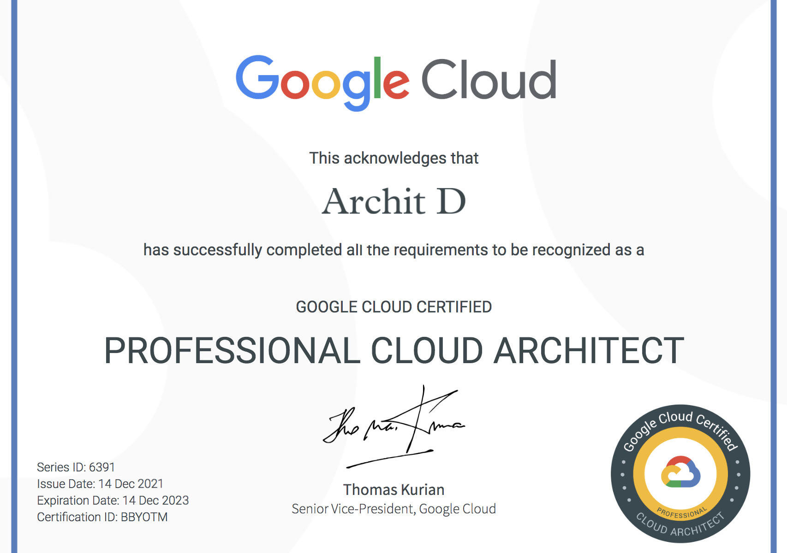

<!-- metadata: version=2.0, registry=google-certification, hash=bd3249e8f0a -->
# 🛡️ Google Cloud Certified – Professional Cloud Architect  
  
  

---

## 📘 Overview

This repository serves as a digitally archived credential record for **Archit D**:  
**Google Cloud Certified – Professional Cloud Architect**

This certification validates the ability to design, develop, and manage dynamic cloud solutions on Google Cloud Platform (GCP), with an emphasis on security, scalability, and operational reliability.

---

## 🗓 Certificate Details

- **Certificate Title:** Google Cloud Certified – Professional Cloud Architect  
- **Issued By:** Google Cloud  
- **Credential ID:** BBYOTM  
- **Issued To:** Archit D  
- **Issue Date:** December 14, 2021  
- **Expiration Date:** December 14, 2023  
- **Credential Status:** Previously Active  
- **Verification Link:** [https://cloud.google.com/certification](https://cloud.google.com/certification)  
- **Metadata File:** [`certificate.json`](./certificate.json)

---

## 🧠 Skills Validated

- Designing secure and scalable cloud architectures  
- Managing and provisioning cloud infrastructure  
- Ensuring compliance and security  
- Architecting for business continuity  
- Optimizing performance and operations

---

## 📄 Certificate Preview

> This certificate acknowledges that **Archit D** has successfully completed all the requirements to be recognized as a **Google Cloud Certified Professional Cloud Architect**.  
>  
> This credential validates the ability to design, develop, and manage secure, scalable, highly available solutions on Google Cloud Platform.

---

## 📁 Purpose of This Repository

This repository is maintained as a personal archive for professional credentialing and is linked from verified online profiles for transparency and historical recordkeeping.

---

## ⚠️ Disclaimer

This repository is not affiliated with or endorsed by Google. The certificate was issued directly to the holder by Google Cloud and is presented here solely for personal archival and documentation purposes.

---

## 📄 License

Content in this repository is protected under a restrictive license.  
Please refer to the [LICENSE](./LICENSE) file for terms of use.
